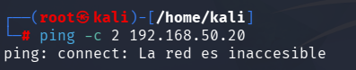
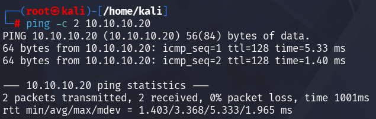
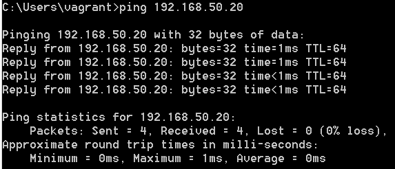
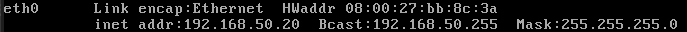

# Laboratorio de Pivoting Avanzado - Preparación eJPTv2

¡Bienvenido a mi primer proyecto de ciberseguridad en github! En este repositorio documento el diseño, montaje y explotación de un entorno de red compartimentada para practicar técnicas de **Pivoting** (enrutamiento de tráfico y salto entre redes), una de las habilidades críticas para el examen eJPTv2.

---

## Arquitectura de la Red del Laboratorio

El escenario simula una infraestructura empresarial donde el atacante no tiene acceso directo a los servidores internos más críticos.

| Máquina VM | Sistema Operativo | Red Expuesta (DMZ) | Red Interna (Oculta) | Rol en el Laboratorio |
| :--- | :--- | :--- | :--- | :--- |
| **Kali Linux** | Kali Linux (Atacante) | `10.10.10.5` | No tiene acceso | Máquina de Auditoría |
| **Windows Server** | Windows Server 2012 | `10.10.10.20` | `192.168.50.10` | Máquina Puente (Víctima 1) |
| **Metasploitable** | Linux Vulnerable | No tiene acceso | `192.168.50.20` | Objetivo Final (Víctima 2) |

---

## Objetivos del Proyecto
1. **Validación de Red:** Demostrar el aislamiento físico entre la máquina atacante y el objetivo final.
2. **Explotación Inicial:** Conseguir una sesión de Meterpreter estable en el Windows Server mediante un payload personalizado de 64 bits.
3. **Pivoting con Metasploit:** Configurar rutas automáticas (`autoroute`) hacia la red oculta.
4. **Túnel de Red Global:** Desplegar un proxy SOCKS5 integrado con `proxychains` para auditar la red interna con herramientas externas como Nmap.

Fase 1: Verificación de Conectividad y Aislamiento de Red
Antes de lanzar cualquier explotación, se realiza una auditoría completa de la topología de red para demostrar el aislamiento de los activos y verificar los vectores de comunicación disponibles.

Paso 1.1: Conectividad desde la Máquina Atacante (Kali Linux)
Aislamiento hacia el Objetivo Final: Intentamos enviar tráfico directo desde Kali (10.10.10.5) hacia Metasploitable (192.168.50.20). El tráfico se pierde por completo, confirmando que la red interna está oculta para nosotros.

Acceso a la Máquina Puente: Comprobamos que tenemos visibilidad directa con el Windows Server 2012 (10.10.10.20), el cual será nuestro único vector de entrada al laboratorio.

Paso 1.2: Conectividad desde la Máquina Puente (Windows Server 2012)
Visibilidad del Objetivo Oculto: Validamos desde la consola del Windows Server que existe conectividad directa con la máquina Metasploitable (192.168.50.20) a través de su segunda interfaz de red interna. Esto demuestra que el servidor Windows es apto para actuar como pivote.

Direccionamiento local de Metasploitable: Verificación local en la máquina objetivo confirmando su IP estática asignada en el segmento interno.

